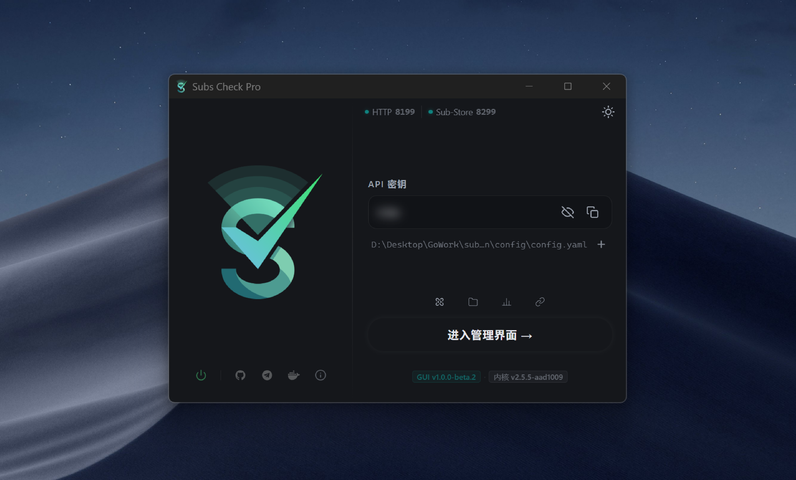
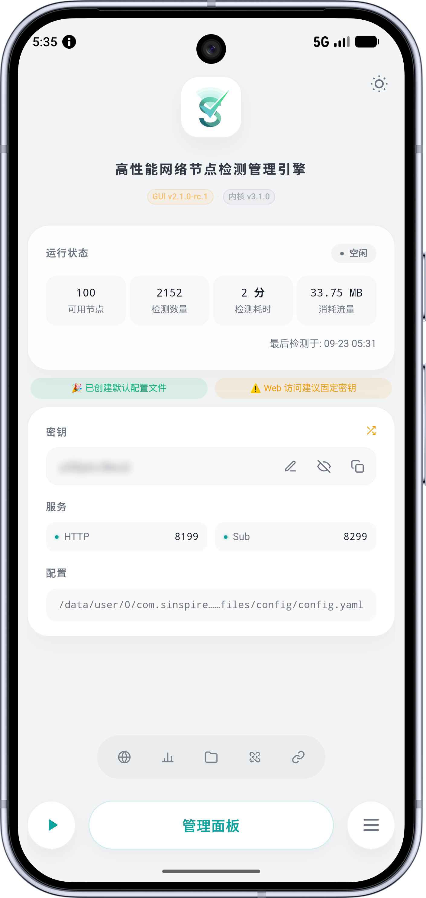
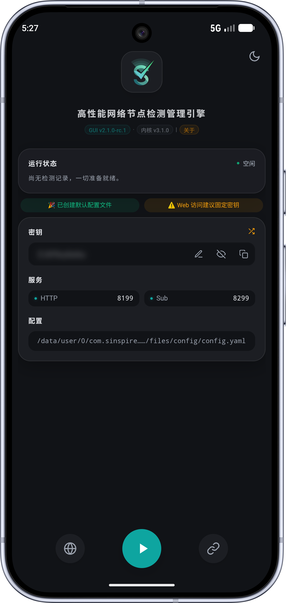

<div align="center">

# Subs Free

基于 [Wails v3](https://v3.wails.io/) 构建，为 [subs-check-pro](https://github.com/sinspired/subs-check-pro) 提供的跨平台客户端程序，支持 `Android 手机` 和  `Windws`、`Linux`、`Mac`。

[](https://go.dev/)
[](https://v3.wails.io/)
[](./LICENCE)

</div>

## 📷 预览

### 💻 桌面端



### 📱 移动端（目前仅支持 Android 手机）

> 深受国产厂商荼毒的旧设备，请使用 `Lite` 版

| 正常版                                       | Lite 版                                                |
| -------------------------------------------- | ------------------------------------------------------ |
|  |  |

## ✨ 特性

- [x] `Windows`、`Linux`、`Mac`、`Android` 原生界面支持
- [x] 开机自启，后台定时运行任务
- [x] 自动检查更新，版本升级
- [x] 支持切换配置文件，端口冲突检测
- [x] 一键获取订阅链接和检测结果分析报告
- [x] 支持原生系统通知
- [x] 支持钉钉，tg，email等通知渠道

## 🖥️ 环境要求

| 工具              | 版本   | 说明                                                        |
| ----------------- | ------ | ----------------------------------------------------------- |
| Go                | ≥ 1.26 |                                                             |
| Node.js           | ≥ 20   |                                                             |
| pnpm / npm / yarn | 任意   | 前端包管理器                                                |
| Wails CLI v3      | beta  | `go install github.com/wailsapp/wails/v3/cmd/wails3@latest` |
| Docker            | 可选   | 跨平台编译时需要                                            |

### Windows 额外依赖

正常 `Windows10` 或 `Windows11` 都已内置 `Webview2`，部分设备长期不更新，或所谓精简版，ghost版，被国内某些 `毒瘤所谓杀毒软件` 嚯嚯过的系统，请自行安装 [Microsoft Edge WebView2](https://developer.microsoft.com/zh-cn/microsoft-edge/webview2)

### Linux 额外依赖

```bash
# Debian/Ubuntu（需要 GTK 4.10+，建议 Ubuntu 24.04 / Debian Trixie）
sudo apt install libgtk-4-dev libwebkit2gtk-4.1-dev
```

> **注意**：Wails v3 使用 `GtkFileDialog`（GTK 4.10+），Debian 12 Bookworm 自带的 GTK 4.8 无法编译。跨平台 Docker 编译请使用 `golang:1.26-trixie` 镜像，详见[跨平台构建](#跨平台构建-docker)。

### Mac 需要处理权限？

```bash
# 用户安装后运行一次即可
xattr -cr /Applications/subs-free.app
```

---

## ⚡️ 快速开始

### 克隆并安装依赖

```bash
git clone https://github.com/sinspired/subs-free.git
cd subs-free
go mod tidy
cd cmd/desktop/frontend && pnpm install && cd ../..
cd cmd/mobile/frontend && pnpm install && cd .../..
```

### 开发模式

```bash
wails3 dev
wails3 task android:run
# 或
wails3 task dev
```

热重载：Go 代码修改后自动重编，前端通过 Vite HMR 即时刷新（默认端口 9245）。

---

## 🤖 构建

### 本机平台

```bash
# 自动检测当前 OS（Windows / macOS / Linux）
wails3 build

# 指定架构
wails3 task windows:build ARCH=amd64
wails3 task darwin:build  ARCH=arm64
wails3 task linux:build   ARCH=amd64
wails3 task android:build ARCH=arm64
```

产物输出到 `bin/` 目录。

### 服务端模式（无 GUI）

去除所有原生 GUI 依赖，以纯 HTTP 服务启动，适合服务器部署：

```bash
wails3 task build:server
# 产物：bin/subs-free-server
```

### Docker 部署（服务端模式）

```bash
# 构建镜像
wails3 task build:docker

# 运行（默认暴露 8080 端口）
wails3 task run:docker

# 自定义 tag 和端口
wails3 task build:docker TAG=myapp:v1.0
wails3 task run:docker TAG=myapp:v1.0 PORT=9000
```

### 跨平台构建（Docker）

从任意 OS 编译其他平台的产物，需要先构建交叉编译镜像（约 800 MB，一次性操作）：

```bash
wails3 task setup:docker
```

之后即可从 Windows / macOS 直接编译 Linux 产物：

```bash
wails3 task linux:build ARCH=amd64
wails3 task linux:build ARCH=arm64
```

---

## ⚙️ 配置

首次运行会自动在以下位置创建 `config.yaml`：

| 平台          | 默认路径                                                      |
| ------------- | ------------------------------------------------------------- |
| Linux / macOS | `~/.config/subs-check-pro/config.yaml`                        |
| Windows       | `%APPDATA%\subs-check-pro\config.yaml`                        |
| Android       | `/data/user/0/com.sinspired.subs_free/files/config/config.yaml` |

关键配置项：

```yaml
# HTTP 服务监听端口（默认 8199）
listen_port: ':8199'

# Sub-Store 端口（默认8299）
sub_store_port: ':8299'

# API 密钥（留空则每次启动随机生成）
api-key: 'your-fixed-key'
```

> 建议在 `config.yaml` 中固定 `api-key`，否则每次重启后密钥变更，需要重新登录。

### 环境变量

| 变量           | 说明                                          |
| -------------- | --------------------------------------------- |
| `CONFIG_PATH`  | 指定配置文件路径                              |
| `APP_VERSION`  | 覆盖显示版本号                                |
| `LOG_LEVEL`    | 日志级别：`debug` / `info` / `warn` / `error` |
| `MIHOMO_DEBUG` | 设置任意值以启用 mihomo 调试日志              |

---

## 👨‍💻 技术栈

**后端**

- [Go 1.27](https://go.dev/) + [Wails v3](https://v3.wails.io/)
- [Gin](https://github.com/gin-gonic/gin) — WebUI HTTP 路由
- [subs-check-pro v3](https://github.com/sinspired/subs-check-pro) — 核心检测引擎

**前端**

- [Preact](https://preactjs.com/) + TypeScript + Vite
- Wails JS Runtime（`@wailsio/runtime`）

**构建工具**

- [Task](https://taskfile.dev/)（跨平台 Makefile 替代）
- [garble](https://github.com/burrowers/garble)（可选代码混淆）
- Docker + Zig 交叉编译工具链

---

## 许可证

[GNU General Public License v3.0](./LICENCE)

---

<div align="center">

⚠️ **请谨慎注意应用分发和修改**
请勿用于非法用途，请于下载 24 小时内删除。
如果这个项目对你有帮助，欢迎点亮 Star ⭐

</div>
